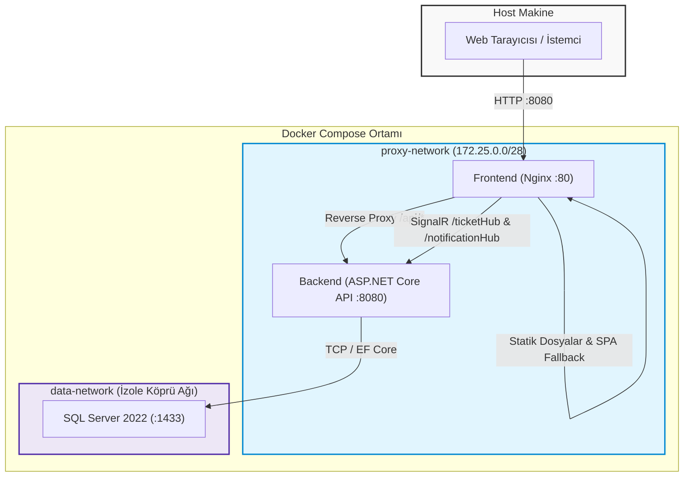
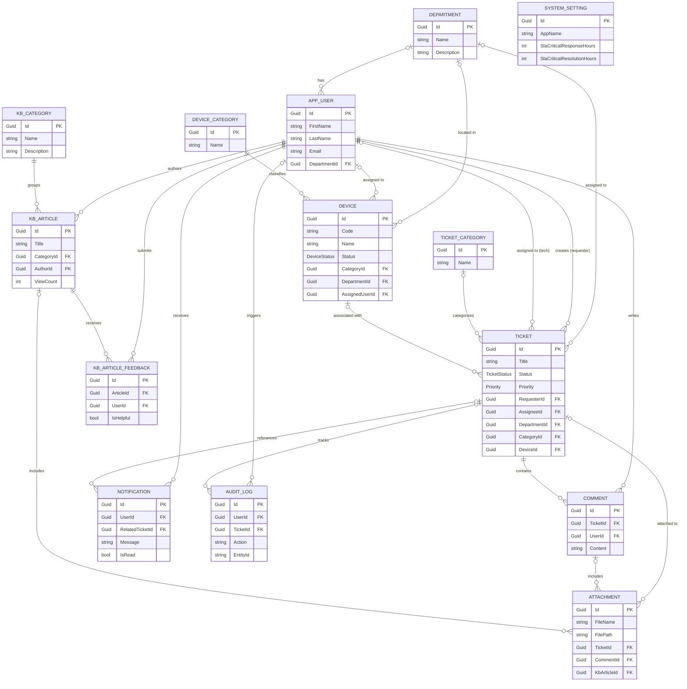

# IT Service Desk

[](https://github.com/tuonde/ITServiceDesk/actions/workflows/ci.yml)

## Genel Bakış

**IT Service Desk**, kurumsal teknik destek süreçlerini ve arıza bildirimlerini yönetmek için tasarlanmış çok katmanlı ve rol tabanlı bir servis yönetim (ITSM) web uygulamasıdır.

Sistem; çalışanların donanım ve yazılım arızalarını bildirebilmelerini, teknisyenlerin kendilerine atanan talepleri çözüme kavuşturabilmelerini ve yöneticilerin (Admin) servis operasyonlarını, cihaz envanterini, SLA takibini, sistem ayarlarını ve denetim kayıtlarını merkezi olarak yönetebilmelerini sağlar.

---

## Ekran Görüntüleri

### Admin Dashboard


### Ticket Yönetimi


### Knowledge Base Yönetimi


### Teknisyen Görevleri


### Zimmetlerim (Kullanıcı Envanteri)


### Yardım Merkezi


---

## Temel Özellikler

| Modül | Açıklama |

|---|---|

| **Ticket Yönetimi** | Öncelik, kategori, atama (assignee), durum akışları, yorumlaşma, dosya ekleme (attachment), talebi yeniden açma (reopen) ve çözüm geçmişi. |

| **Rol Tabanlı Erişim** | Admin, Technician ve User rolleri; ASP.NET Identity ve claim/resource-based yetkilendirme altyapısı. |

| **Envanter & Zimmet** | Donanım/cihaz tanımlama, personele cihaz zimmetleme, cihaz bazlı arıza geçmişi ve ticket-envanter entegrasyonu. |

| **Canlı Bildirimler** | SignalR entegrasyonu ile anlık durum güncellemeleri ve kalıcı veritabanı bildirimleri. |

| **Knowledge Base** | Kategori yapısı, zengin metin (HTML) makaleler, rol bazlı makale görünürlüğü ve personel yardım merkezi. |

| **SLA & Eskalasyon** | Öncelik bazlı SLA yanıt/çözüm süreleri takibi, arka plan çalışanı (Background Worker) ile otomatik SLA ihlal denetimi. |

| **Raporlama & Audit** | Dashboard KPI metrikleri, teknisyen performans analizi, kategori dağılımları ve detaylı işlem denetim günlükleri (AuditLog). |

| **Sistem Ayarları** | Güvenlik politikaları, dosya yükleme limitleri, SLA yapılandırması ve dinamik logo yönetimi. |

---

## Kullanıcı Rolleri

| Rol | Temel Yetki ve Kapsam |

|---|---|

| **User (Kullanıcı)** | Kendi arıza bildirimlerini oluşturma ve takip etme, yorum/dosya ekleme, kapalı talebi yeniden açma, zimmetli cihazlarını listeleme ve yardım merkezinden yararlanma. |

| **Technician (Teknisyen)** | Kendisine atanmış veya havuzdaki talepleri üstlenme, durum güncelleme (In Progress, Resolved vb.), teknik yorum ve ek yükleme, zimmet detaylarını inceleme. |

| **Admin (Yönetici)** | Tüm ticket operasyonlarını yönetme, kullanıcı/departman/envanter yönetimi, sistem genel ayarları, SLA parametreleri, raporlar, Knowledge Base yönetimi ve Audit Log inceleme. |

---

## Kullanılan Teknolojiler

### Backend

- .NET 8 (C#) & ASP.NET Core Web API

- Entity Framework Core 8

- Microsoft SQL Server

- ASP.NET Core Identity & JWT Authentication

- SignalR

- AutoMapper

- FluentValidation

- Serilog

### Frontend

- React 19 & TypeScript

- Vite

- Tailwind CSS

- Axios

- React Router

- Recharts

- Lucide Icons

- DOMPurify

### Test Altyapısı

- **xUnit & Moq:** Backend birim testleri

- **WebApplicationFactory & Testcontainers:** Gerçek SQL Server ile API entegrasyon testleri

- **Vitest & React Testing Library:** Frontend bileşen testleri

- **Playwright:** Gerçek tarayıcı, API ve veritabanı üzerinde çalışan uçtan uca testler

### Altyapı

- Docker & Docker Compose

- Nginx

- GitHub Actions CI

---

## Mimari ve Çalışma Zamanı Topolojisi

Uygulama, sorumlulukların ayrıştırıldığı **Çok Katmanlı (N-Tier / Layered) Mimari** prensiplerine göre yapılandırılmıştır:

- **`ITServiceDesk.Core`:** Varlık modelleri (Entities), enumlar, DTO sözleşmeleri ve temel arayüzler (Interfaces).

- **`ITServiceDesk.Data`:** `ITServiceDeskDbContext`, entity konfigürasyonları, EF Core migration'ları ve repository implementasyonları.

- **`ITServiceDesk.Service`:** Temel iş mantığı (Business Logic), validasyonlar, servis katmanı, SLA hesaplayıcıları ve arka plan işçileri.

- **`ITServiceDesk.API`:** HTTP Controller uçları, middleware yapılandırmaları, SignalR hub'ları ve Dependency Injection tanımları.

- **`ITServiceDesk.Client`:** Nginx üzerinde statik olarak sunulan React/TypeScript Single Page Application (SPA).

### Docker Ağ ve Konteyner Topolojisi



### İstek Akışı ve Ağ İzolasyonu

1. **İstemci Erişimi:** Host makineye publish edilen tek uygulama portu `8080`'dir.

2. **Reverse Proxy:** Nginx, gelen `/api/*` isteklerini ve SignalR bağlantılarını `proxy-network` üzerinden API konteynerine aktarır.

3. **Ağ İzolasyonu:**

   - `proxy-network`: Frontend ve API konteynerleri arasındaki haberleşmeyi sağlar.

   - `data-network`: Yalnızca API ve SQL Server konteynerleri arasındadır.

   - Frontend konteynerinin SQL Server ağına doğrudan erişimi yoktur.

   - SQL Server ve API portları host makineye publish edilmez.

---

## Veritabanı İlişki Şeması (ERD)

Aşağıdaki şema sistemin temel domain varlıklarını, ilişkilerini ve kardinalitelerini göstermektedir:



> [!NOTE]

> **Önemli Model Kısıtları**

>

> - `KbArticleFeedback`: Kullanıcı başına makale bazında tek geri bildirim kısıtı (`UNIQUE (ArticleId, UserId)`).

> - `Ticket`: `RequesterId` zorunludur (`OnDelete: Restrict`); `AssigneeId`, `DepartmentId`, `CategoryId` ve `DeviceId` isteğe bağlıdır.

> - `Attachment`: `Ticket`, `Comment` veya `KbArticle` ile ilişkilendirilebilen nullable foreign key alanları içerir.

---

## Güvenlik Mimarisi

- **Kimlik Doğrulama & Yetkilendirme:** JWT tabanlı authentication, rol/claim tabanlı authorization ve kaynak bazlı erişim kontrolleri.

- **BOLA / IDOR Kontrolleri:** Kullanıcıların yalnızca erişim yetkisine sahip oldukları kaynaklar üzerinde işlem yapabilmesi backend seviyesinde doğrulanır.

- **Hız Sınırlaması (Rate Limiting):** Aşırı istek ve brute-force denemelerini sınırlandırmak amacıyla fixed-window rate limiter kullanılır.

- **Güvenlik Başlıkları:** `X-Content-Type-Options: nosniff`, `X-Frame-Options: DENY` ve `Referrer-Policy: strict-origin-when-cross-origin`.

- **Content Security Policy:** Nginx üzerinde `script-src 'self'`, `frame-ancestors 'none'` ve `object-src 'none'` gibi kısıtlamalar uygulanır.

- **Swagger İzolasyonu:** Swagger UI yalnızca Development ortamında aktiftir.

### Dosya Yükleme Koruması

- **Nginx taşıma sınırı:** `client_max_body_size 12M`

- **API iş mantığı sınırı:** Maksimum 10 MB

- **Dosya doğrulama:** İzin verilen uzantılar ve magic-byte/file signature kontrolleri birlikte uygulanır.

- **Ticket ekleri:** `.pdf`, `.png`, `.jpg`, `.jpeg`, `.docx`, `.xlsx`, `.txt` formatları desteklenir.

- **Özel logo yükleme:** Yalnızca Admin rolündeki kullanıcılar logo yükleyebilir.

- Logo formatları `.png`, `.jpg`, `.jpeg` ve `.webp` ile sınırlandırılmıştır.

- SVG logo desteği aktif içerik/XSS riskini azaltmak amacıyla desteklenmez.

- Logo dosyalarının içeriği uzantıdan bağımsız olarak dosya imzası üzerinden doğrulanır.

### Bootstrap Admin Güvenliği

Temiz kurulumlarda ilk Admin hesabı açıkça tanımlanan BootstrapAdmin ayarları üzerinden oluşturulur.

- Kullanıcı mevcut değilse yeni Admin hesabı oluşturulur.

- Aynı hesap zaten Admin ise herhangi bir değişiklik yapılmaz.

- Aynı e-posta normal bir kullanıcıya aitse kullanıcı otomatik olarak Admin'e yükseltilmez.

- Bu durumda uygulama yetki yükseltme riskini önlemek amacıyla başlangıcı fail-closed şekilde durdurur.

### Kayıt ve Rol Güvenliği

Public registration üzerinden oluşturulan yeni hesaplar her zaman standart `User` rolüyle oluşturulur. Kayıt sırasında `Admin` veya `Technician` rolü seçilemez. İlk yönetici hesabı BootstrapAdmin mekanizmasıyla oluşturulur; sonraki rol atamaları ise yetkili yönetici işlemleri üzerinden gerçekleştirilir.

### Secret Yönetimi

Production-like ortamda güvenli bir `JWT_SECRET` tanımlanmadığında uygulama başlamayı reddeder.

> [!NOTE]

> **Güvenlik Notları ve Kabul Edilen Sınırlamalar**

>

> - JWT access token istemci tarafında `localStorage` üzerinde saklanmaktadır.

> - Yerel Docker Compose ortamı HTTP üzerinde çalışmaktadır.

> - Gerçek canlı dağıtımda TLS/HTTPS sonlandırması ve HSTS politikası en dış reverse proxy / ingress katmanında uygulanmalıdır.

---

## Sağlık İzleme ve Gözlemlenebilirlik

Sistem iki ayrı health endpoint sunmaktadır:

- **`/health/live` (Liveness):** API sürecinin çalıştığını ve isteklere yanıt verebildiğini doğrular.

- **`/health/ready` (Readiness):** Yapılandırılmış readiness kontrollerini çalıştırır. Mevcut durumda SQL Server / DbContext bağlantısı kontrol edilmektedir.

### Konteyner Sağlık Kontrolleri

- **SQL Server:** `sqlcmd` ile periyodik kontrol.

- **API:** `curl` ile `/health/ready` kontrolü.

- **Frontend:** `wget` ile Nginx sağlık kontrolü.

- API, SQL Server healthy duruma gelmeden başlamaz.

- Frontend, API hazır olmadan devreye girmez.

### Yapılandırılmış Loglama

- **Serilog:** Loglar stdout/stderr üzerine yapılandırılmış console formatında yazılır.

- `SourceContext`, `RequestId` ve `ElapsedMilliseconds` gibi bilgiler loglara eklenir.

- HTTP istek tamamlanma olayları request logging ile kaydedilir.

- Health check ve polling istekleri gereksiz log yoğunluğunu azaltmak amacıyla filtrelenir.

### Hassas Veri Loglama Politikası

JWT secret, kullanıcı/SQL Server parolaları ve `Authorization` başlıkları log çıktılarına dahil edilmez.

---

## Test Altyapısı ve Kalite Güvencesi

Projede **78 otomatik test** bulunmaktadır:

```text

[Toplam 78 Otomatik Test]

├── 24 Backend Unit Tests

│   └── xUnit + Moq

│

├── 42 Backend API / SQL Integration Tests

│   └── WebApplicationFactory + Testcontainers MSSQL

│

├── 10 Frontend Component Tests

│   └── Vitest + React Testing Library

│

└── 2 E2E System Tests

    └── Playwright

```

### Backend Unit Testleri

Temel servis davranışları ve iş kuralları dış bağımlılıklardan izole şekilde test edilir.

### Entegrasyon Testleri

`WebApplicationFactory` ile API test ortamında çalıştırılır.

Testcontainers kullanılarak geçici ve izole bir SQL Server konteyneri oluşturulur. Böylece:

- migration davranışları,

- foreign key ilişkileri,

- unique constraint'ler,

- SQL Server'a özgü sorgu davranışları

gerçek ilişkisel veritabanı üzerinde doğrulanabilir.

BootstrapAdmin privilege escalation ve logo upload güvenliği için regression testleri de bu test katmanında bulunmaktadır.

### Frontend Testleri

Vitest ve React Testing Library kullanılarak form, bileşen ve temel kullanıcı etkileşimleri test edilir.

### E2E Testleri

Playwright ile gerçek tarayıcı, API ve SQL Server birlikte kullanılır.

Kritik ticket yaşam döngüsünde:

```text

User → Admin → Technician → User

```

akışı uçtan uca doğrulanır.

### Test Komutları

#### Backend

```powershell

dotnet test -c Release

```

#### Frontend

```powershell

cd ITServiceDesk.Client

npm ci

npm run lint

npm run test:run

npm run build

```

#### E2E

```powershell

cd ITServiceDesk.Client

npm run e2e

```

---

## Sürekli Entegrasyon (CI)

GitHub Actions üzerinde `.github/workflows/ci.yml` içerisinde tanımlanan CI süreci;

- `main`

- `production-hardening`

branch'lerine yapılan `push` işlemlerinde ve `main` branch'ine açılan pull request'lerde çalışır.

### Backend CI

- Dependency restore

- Release build

- Unit tests

- Integration tests

### Frontend CI

- NPM dependency kurulumu

- ESLint

- Vitest / RTL testleri

- Vite production build

- Bilgilendirme amaçlı `npm audit`

### E2E CI

Playwright tarayıcıları ve geçici SQL Server test ortamı hazırlanarak kritik uçtan uca kullanıcı akışları doğrulanır.

> Projede otomatik deployment (CD) pipeline'ı bulunmamaktadır. GitHub Actions yalnızca sürekli entegrasyon ve kalite kontrolleri için kullanılmaktadır.

---

# Kurulum ve Çalıştırma

## 1. Docker Compose ile Hızlı Kurulum (Production-Like Ortam)

Projeyi frontend, backend API ve SQL Server ile birlikte izole Docker konteynerlerinde çalıştırmak için aşağıdaki adımlar uygulanabilir.

### 1. Repository'yi Klonlayın

```bash

git clone https://github.com/tuonde/ITServiceDesk.git

cd ITServiceDesk

```

### 2. Çevre Değişkenlerini Oluşturun

Örnek yapılandırma dosyasını `.env` olarak kopyalayın:

```bash

cp .env.example .env

```

Windows PowerShell:

```powershell

copy .env.example .env

```

Ardından `.env` dosyasını açarak en az aşağıdaki değerleri kendi ortamınıza uygun şekilde belirleyin:

```env

SQL_SA_PASSWORD=<guclu-sql-server-parolasi>

JWT_SECRET=<en-az-32-karakter-uzunlugunda-guclu-bir-secret>

DEMO_DATA_ENABLED=false

```

> [!IMPORTANT]

> Temiz veya gerçek kullanım amaçlı kurulumlarda `DEMO_DATA_ENABLED=false` bırakılmalıdır.

>

> Bu ayar kapalı olduğunda demo kullanıcılar, örnek ticket'lar, cihazlar ve diğer demo iş verileri oluşturulmaz.

>

> `DEMO_DATA_ENABLED=true` yalnızca geliştirme, test veya proje gösterimi amacıyla kullanılmalıdır.

### 3. İlk Admin Hesabını Tanımlayın

Temiz kurulumda demo kullanıcı oluşturulmadığı için sisteme ilk erişimi sağlayacak Admin hesabı BootstrapAdmin mekanizması ile oluşturulur.

`.env` dosyasına aşağıdaki değerleri ekleyin:

```env

DEMO_DATA_ENABLED=false

BOOTSTRAP_ADMIN_ENABLED=true

BOOTSTRAP_ADMIN_EMAIL=admin@sirketdomain.com

BOOTSTRAP_ADMIN_PASSWORD=<guclu-admin-parolasi>

```

E-posta ve parola gerçek kurulum ortamına göre değiştirilmelidir.

### 4. Konteynerleri Başlatın

```bash

docker compose up -d --build

```

Servis durumlarını görmek için:

```bash

docker compose ps

```

SQL Server, API ve frontend servislerinin `healthy` durumuna gelmesi beklenmelidir.

### 5. Uygulamaya Erişin

Tarayıcıdan:

```text

http://localhost:8080

```

adresine gidin ve `.env` dosyasında belirlediğiniz BootstrapAdmin hesabıyla giriş yapın.

### 6. BootstrapAdmin'i Devre Dışı Bırakın

İlk Admin hesabının başarıyla oluşturulduğu doğrulandıktan sonra `.env` içerisinde:

```env

BOOTSTRAP_ADMIN_ENABLED=false

```

yapılması önerilir.

Ayrıca `BOOTSTRAP_ADMIN_PASSWORD` değerinin ortam yapılandırmasından kaldırılması gerekir.

Bootstrap mekanizmasının kapatılması oluşturulmuş Admin hesabını silmez. Yalnızca uygulama başlangıcındaki bootstrap işlemini devre dışı bırakır.

> [!IMPORTANT]

> Bootstrap için tanımlanan e-posta sistemde zaten mevcut ancak kullanıcı Admin rolünde değilse otomatik yetki yükseltme yapılmaz. Uygulama güvenlik amacıyla başlangıcı fail-closed şekilde durdurur.

---

## 2. Temiz Kurulum ve Demo Ortamı Arasındaki Fark

ITServiceDesk iki farklı başlangıç senaryosunu destekler.

### Temiz / Kurumsal Kurulum

```env

DEMO_DATA_ENABLED=false

BOOTSTRAP_ADMIN_ENABLED=true

```

Bu durumda:

- Demo kullanıcılar oluşturulmaz.

- Örnek ticket'lar oluşturulmaz.

- Demo cihaz ve iş verileri oluşturulmaz.

- Veritabanı migration'ları uygulanır.

- Yalnızca `.env` içerisinde belirtilen başlangıç Admin hesabı oluşturulur.

- Gerçek departmanlar, kullanıcılar, teknisyenler, kategoriler ve cihazlar daha sonra sistem üzerinden eklenebilir.

### Demo / Geliştirme Ortamı

```env

DEMO_DATA_ENABLED=true

```

Bu durumda örnek kullanıcılar ve uygulamanın denenmesi için hazırlanmış demo veriler otomatik olarak oluşturulur.

Demo ortamı gerçek kurumsal veri girişi için değil, geliştirme, test ve proje gösterimi amacıyla kullanılmalıdır.

---

## 3. Yerel Geliştirme (Local Development)

Docker kullanmadan doğrudan yerel ortamda çalıştırmak için:

### Gereksinimler

- .NET 8 SDK

- Node.js 24 önerilir

- SQL Server LocalDB veya SQL Server Express

### 1. Veritabanı Migration'larını Uygulayın

```powershell

dotnet ef database update --project ITServiceDesk.Data --startup-project ITServiceDesk.API

```

### 2. Backend API'yi Başlatın

```powershell

cd ITServiceDesk.API

dotnet run

```

API varsayılan geliştirme yapılandırmasında:

```text

http://localhost:5014

```

adresinde çalışır.

Swagger Development ortamında:

```text

http://localhost:5014/swagger

```

adresinden kullanılabilir.

### 3. Frontend İstemcisini Başlatın

```powershell

cd ITServiceDesk.Client

npm ci

npm run dev

```

Frontend:

```text

http://localhost:5173

```

adresinde çalışır.

### Geliştirme Modu Demo Hesapları

Development ortamında `DemoData:Enabled=true` veya karşılık gelen environment ayarı etkinleştirildiğinde örnek verilerle birlikte aşağıdaki demo hesapları oluşturulur:

| Rol | E-posta | Şifre |

|---|---|---|

| **Admin** | `admin@itservicedesk.local` | `Demo12345!` |

| **Technician** | `tech@itservicedesk.local` | `Demo12345!` |

| **User** | `user@itservicedesk.local` | `Demo12345!` |

Bu hesaplar yalnızca local development, test ve proje gösterimi amacıyla kullanılmalıdır.

> [!WARNING]

> Demo hesapları ve `Demo12345!` parolası gerçek veya production-like kurulumlarda kullanılmamalıdır. Temiz kurulumlarda `DEMO_DATA_ENABLED=false` bırakılmalı ve ilk yönetici hesabı BootstrapAdmin mekanizmasıyla oluşturulmalıdır.

---

## Kalıcı Veri Saklama (Persistence)

Docker ortamında iki adet named volume kullanılmaktadır:

- **`sqlserver-data`:** SQL Server veritabanı dosyalarının `/var/opt/mssql` altında kalıcı olarak saklanmasını sağlar.

- **`api-uploads`:** Ticket ekleri ve özel logo dosyalarının `/app/App_Data/uploads` altında kalıcı olarak saklanmasını sağlar.

Bu nedenle konteynerlerin yeniden başlatılması veya:

```bash

docker compose down

```

komutunun kullanılması veritabanını ve yüklenen dosyaları silmez.

Container'lar tekrar başlatıldığında mevcut veriler kullanılmaya devam edilir.

Ancak:

```bash

docker compose down -v

```

komutu named volume'ları da kaldırır.

Bu işlem:

- SQL Server veritabanını,

- ticket attachment dosyalarını,

- yüklenen özel logo dosyalarını

kalıcı olarak silebilir.

Gerçek veri bulunan ortamlarda `docker compose down -v` komutu dikkatli kullanılmalıdır.

---

## Dağıtım Durumu (Deployment Scope)

Bu repository **production-like bir Docker Compose topolojisi** sunmaktadır.

Proje içerisinde:

- frontend reverse proxy,

- API,

- SQL Server,

- ağ izolasyonu,

- health checks,

- kalıcı volume'lar,

- structured logging,

- güvenlik başlıkları

yapılandırılmıştır.

Ancak repository gerçek bir public production deployment içermez.

Aşağıdaki kurumsal altyapı bileşenleri proje kapsamı dışındadır ve gerçek canlıya geçiş sırasında barındırma ortamında ayrıca ele alınmalıdır:

- TLS/SSL sertifika sağlama ve yönetimi

- HSTS'nin canlı proxy seviyesinde uygulanması

- Load Balancing

- High Availability

- Kubernetes / bulut dağıtım manifestoları

- Otomatik veritabanı yedekleme

- Disaster Recovery

- Merkezi log toplama ve izleme altyapısı

---

## Bilinen Teknik Sınırlamalar (Technical Debt)

- **JWT Depolama:** Access token'lar tarayıcıda `localStorage` üzerinde saklanmaktadır.

- **Kestrel HTTPS Uyarısı:** Yerel HTTP Docker Compose ortamında `Failed to determine the https port for redirect.` uyarısı görülebilir. Gerçek dağıtımda TLS reverse proxy seviyesinde ele alınmalıdır.

- **ReactQuill CSP Kapsamı:** Zengin metin editörüne özgü bağımsız CSP E2E kapsamı bulunmamaktadır.

- **Frontend Lint Uyarıları:** Bazı `useEffect` hook'larında mevcut dependency uyarıları bulunmaktadır.

- **npm audit:** Frontend bağımlılıkları için bilinen denetim bulguları bulunmaktadır ve periyodik bağımlılık güncellemesi gerektirir.

- **Backend Derleyici Uyarıları:** Bazı nullable/async uyarıları teknik borç olarak bulunmaktadır.

- **SQL Server Sürümü:** SQL Server 2022 CU14 image sürümü periyodik güvenlik ve bakım güncellemesi takibi gerektirir.

---

## Proje Dizin Yapısı

```text

ITServiceDesk/

│

├── .github/

│   └── workflows/

│       └── ci.yml

│

├── ITServiceDesk.API/

│   └── ASP.NET Core Web API, Controller'lar, Middleware ve SignalR

│

├── ITServiceDesk.Client/

│   ├── nginx.conf

│   └── React / TypeScript Frontend

│

├── ITServiceDesk.Core/

│   └── Domain modelleri, DTO'lar ve arayüzler

│

├── ITServiceDesk.Data/

│   └── EF Core DbContext, Migration ve Repository'ler

│

├── ITServiceDesk.Service/

│   └── İş mantığı, servisler, SLA ve validasyonlar

│

├── tests/

│   ├── ITServiceDesk.UnitTests/

│   └── ITServiceDesk.IntegrationTests/

│

├── compose.yaml

├── .env.example

└── README.md

```