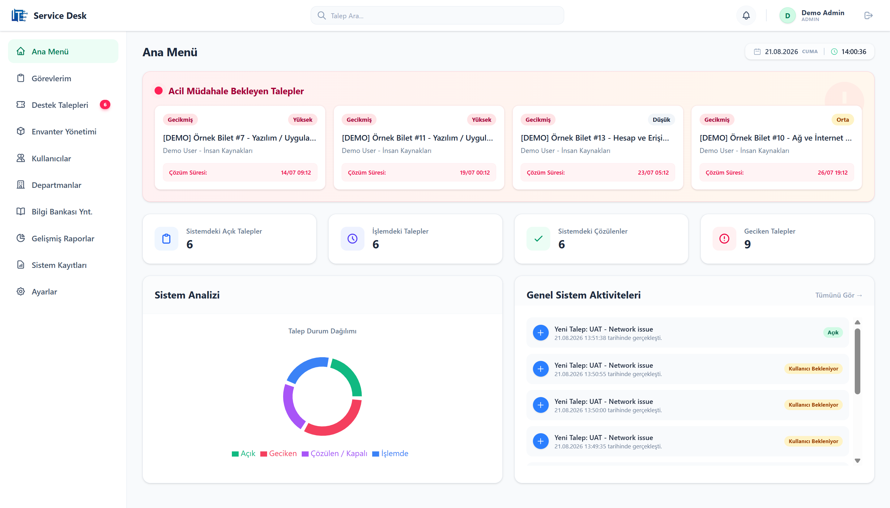
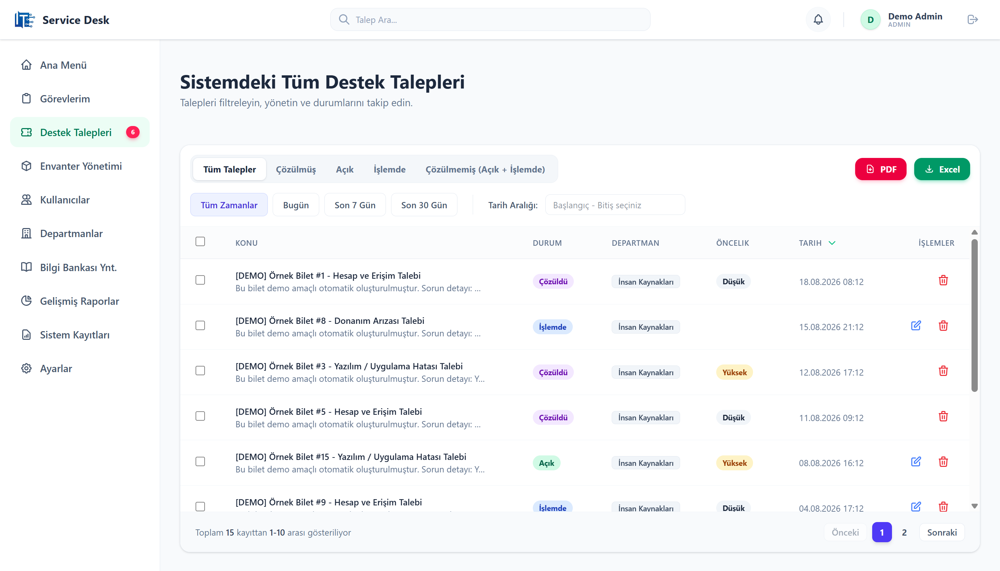
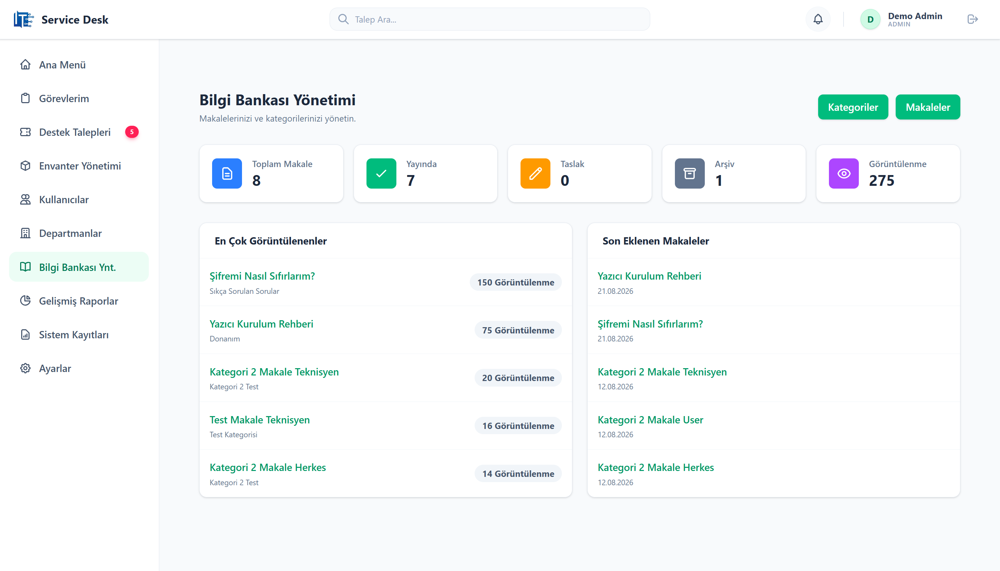
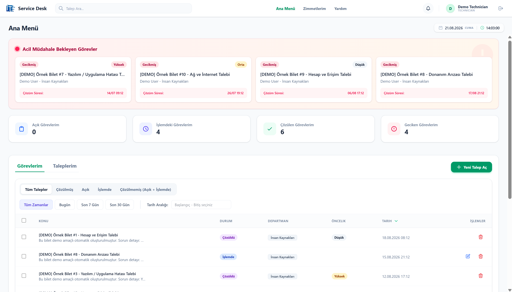
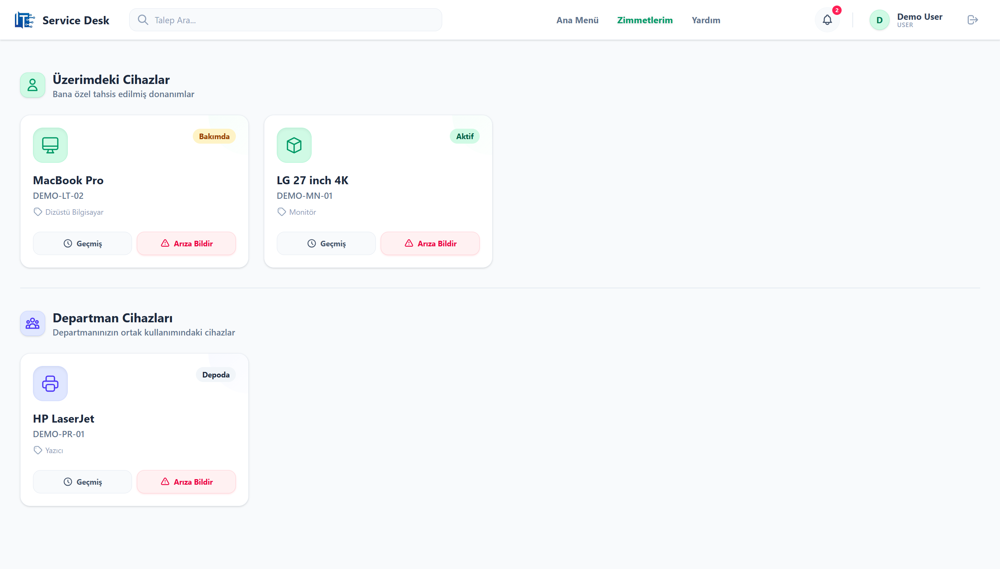
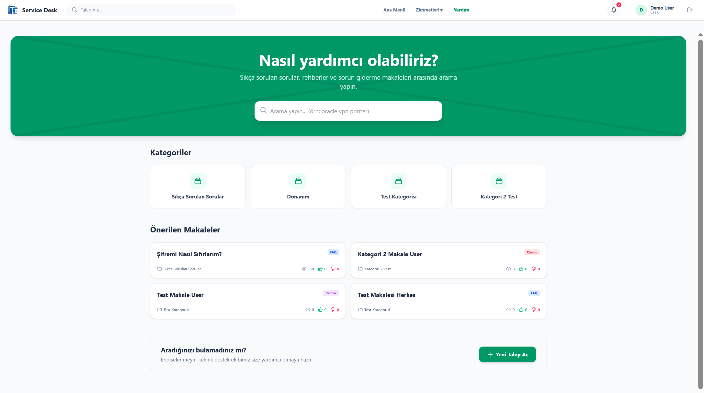

# IT Service Desk

[](https://github.com/tuonde/ITServiceDesk/actions/workflows/ci.yml)

## Personel Arıza Bildirim ve Çözüm Takip Sistemi

Çalışanların teknik arızaları bildirebildiği, BT ekibinin talepleri yönettiği, teknisyenlerin kendilerine atanmış işleri takip ettiği, envanter, SLA, bildirim ve bilgi bankası özelliklerini içeren web tabanlı bir servis yönetim uygulaması. Bu proje, bir bilgisayar mühendisliği staj çalışması kapsamında geliştirilmiştir.

## Özellikler

### Ticket Yönetimi
- Ticket oluşturma
- Öncelik (Priority)
- Kategori
- Atama (Assignee)
- Durum yönetimi (Status)
- Comment
- Attachment
- Reopen
- SLA

### Kullanıcı & Rol Yönetimi
- Admin
- Technician
- User
- ASP.NET Identity
- role-based/resource-based authorization

### Envanter
- Device management
- Zimmet (Cihaz Atama)
- Ticket ↔ Device entegrasyonu
- Cihaz arıza geçmişi

### Notification
- Kalıcı bildirimler
- SignalR real-time events

### Knowledge Base (Bilgi Bankası)
- Kategoriler
- Makaleler
- Help Center (Yardım Merkezi)
- Feedback (Geri Bildirim)
- Visibility (Yetki bazlı görünürlük)

### Reporting
- Dashboard metrics
- Technician performance
- Category distribution

### Audit / Settings
- AuditLog
- Application/Security/SLA settings

## Roller

| Rol | Temel Yetkiler |
|---|---|
| User | Kendi talepleri, yorum, attachment, reopen, zimmet, yardım merkezi |
| Technician | Atanmış talepler, durum/yorum, zimmet, yardım merkezi |
| Admin | Ticket yönetimi, kullanıcı, departman, envanter, raporlar, ayarlar, KB, audit |

## Ekran Görüntüleri

### Admin Dashboard


### Ticket Yönetimi


### Knowledge Base Yönetimi


### Teknisyen Görevleri


### Zimmetlerim


### Yardım Merkezi


## Kullanılan Teknolojiler

**Backend:**
- ASP.NET Core 8 Web API
- C#
- Entity Framework Core
- SQL Server
- ASP.NET Identity
- JWT
- SignalR
- AutoMapper
- FluentValidation
- Serilog

**Frontend:**
- React
- TypeScript
- Vite
- Tailwind CSS
- Axios
- React Router
- Recharts

## Mimari

Uygulama temel olarak N-Katmanlı (N-Tier) mimari desenleri gözetilerek geliştirilmiştir.

```text
React Client (Frontend)
      ↓
ASP.NET Core Web API (API Layer)
      ↓
Service Layer (Business Logic)
      ↓
Repository / Data Layer (Veri Erişimi)
      ↓
EF Core (ORM)
      ↓
SQL Server (Database)
```

- **ITServiceDesk.Core:** Entity modelleri, enumlar, DTO sözleşmeleri ve abstract interfaceler bulunur.
- **ITServiceDesk.Data:** Veritabanı bağlamı (DbContext), konfigürasyonlar, repository implementasyonları ve EF Core migration'larını barındırır.
- **ITServiceDesk.Service:** Temel iş mantığı (business logic), validasyonlar, servis implementasyonları ve mapper profillerini içerir.
- **ITServiceDesk.API:** Sunucu giriş noktasıdır. Controller uç noktalarını, middleware'leri, SignalR Hub'larını ve bağımlılık enjeksiyonlarını tanımlar.
- **ITServiceDesk.Client:** Vite tabanlı, Tailwind ile şekillendirilmiş React/TypeScript frontend projesidir.

## Proje Yapısı

```text
ITServiceDesk/
├── ITServiceDesk.API/
├── ITServiceDesk.Client/
├── ITServiceDesk.Core/
├── ITServiceDesk.Data/
└── ITServiceDesk.Service/
```

## Ön Koşullar

Projeyi kendi bilgisayarınızda derleyip çalıştırabilmeniz için aşağıdaki araçların yüklü olması gerekir:

- Git
- .NET 8 SDK (`dotnet --version` ile test edilebilir)
- Node.js 18+ (`node --version` ile test edilebilir)
- npm (`npm --version` ile test edilebilir)
- SQL Server (Express veya Developer versiyonu, varsayılan instance olarak `.\SQLEXPRESS` tavsiye edilir)
- EF Core CLI (`dotnet ef --version` ile test edilebilir)

Eğer EF Core CLI bilgisayarınızda yüklü değilse, terminal (komut satırı) üzerinden aşağıdaki komut ile kurabilirsiniz:
```powershell
dotnet tool install --global dotnet-ef
```
*(Yüklenecek sürümün .NET 8 ile uyumlu olmasına dikkat ediniz.)*

## Kurulum

### 1. Repository'yi Klonlama

Terminal üzerinden projeyi bilgisayarınıza indirin ve klasöre girin:
```powershell
git clone https://github.com/tuonde/ITServiceDesk.git
cd ITServiceDesk
```

### 2. Database'i Hazırlama

Veritabanını oluşturmak ve tabloları kurmak (migration uygulamak) için aşağıdaki komutu çalıştırın:
```powershell
dotnet ef database update --project ITServiceDesk.Data --startup-project ITServiceDesk.API
```
Bu komut, bilgisayarınızda varsayılan olarak tanımlı olan SQL Server (`.\SQLEXPRESS`) üzerinde `ITServiceDeskDb` adında bir veritabanı oluşturacak ve mevcut şema değişikliklerini uygulayacaktır.

Eğer farklı bir SQL Server instance'ı kullanıyorsanız, PowerShell üzerinden environment variable ile connection string tanımlayabilirsiniz:
```powershell
$env:ConnectionStrings__DefaultConnection="Server=SİZİN_SUNUCUNUZ;Database=ITServiceDeskDb;Trusted_Connection=True;TrustServerCertificate=True;MultipleActiveResultSets=true"
```

### 3. Backend'i Başlatma

API projesi klasörüne girip backend sunucusunu başlatın:
```powershell
cd ITServiceDesk.API
dotnet run
```
Backend sunucusu başarıyla başladığında `http://localhost:5014` adresi üzerinden yayına girmiş olacaktır. (Swagger dokümantasyonuna Development ortamında `http://localhost:5014/swagger` üzerinden erişebilirsiniz.)

### 4. Frontend'i Başlatma

Yeni bir komut penceresi/terminal açın ve frontend projesinin olduğu dizine geçin:
```powershell
cd ITServiceDesk.Client
```
Önce NPM paketlerini kurun. Daha temiz, tutarlı ve öngörülebilir bir paket kurulumu için (package-lock.json dosyasını esas alarak) `ci` komutunu kullanın:
```powershell
npm ci
```
Ardından frontend uygulamasını geliştirme (development) modunda başlatın:
```powershell
npm run dev
```
Uygulama `http://localhost:5173` adresinde çalışacaktır. (Vite konfigürasyonundaki proxy kuralları sayesinde, `/api` çağrıları ve SignalR bağlantıları otomatik olarak arka planda `localhost:5014` portuna yönlendirilir.)

## Demo Verileri ve Hesaplar

Development modunda ilk çalıştırdığınızda (ve eğer `appsettings.json` içerisindeki `DemoData.Enabled` özelliği `true` ise), `DemoDataSeeder` sistemi otomatik olarak devreye girer. Bu mekanizma, boş bir veritabanını test için tamamen hazır hale getirmek için tasarlanmıştır. Bu işlem Idempotent (tekrarlanabilir) özelliktedir; yani aynı veri daha önce var ise işlem atlanır.

Fresh database üzerine kurulumdan sonra yaklaşık:
- 3 adet demo kullanıcı hesabı,
- 15 adet örnek Ticket (talep),
- 5 adet donanım/cihaz kaydı (Device),
- Gerekli Departmanlar ve Kategoriler,
- Varsayılan SystemSettings (SLA saatleri vs.),
- Yardım Merkezi (KB) içerikleri,
- Yorumlar ve Bildirimler

otomatik olarak oluşturulur.

### Demo Hesaplar

| Rol | E-posta | Şifre |
|---|---|---|
| Admin | admin@itservicedesk.local | Demo12345! |
| Technician | tech@itservicedesk.local | Demo12345! |
| User | user@itservicedesk.local | Demo12345! |

> **UYARI:** Bu hesaplar ve parola yalnızca local Development ve demo amacıyla kullanılmaktadır. Production (Canlı) ortamında demo seeding KESİNLİKLE devre dışıdır. Eğer bu demoyu devre dışı bırakmak isterseniz `ITServiceDesk.API/appsettings.json` içerisinde `DemoData:Enabled` değerini `false` yapabilirsiniz.

## Ortam Yapılandırması

Uygulamanın davranışları bulunduğu ortama (Environment) göre değişiklik gösterir.

### Development (Geliştirme)
- `JWT_SECRET` ortam değişkeninin atanması zorunlu değildir, otomatik olarak "developer secret" fallback mekanizması devreye girer.
- Veritabanı yapılandırması varsayılan olarak `.\SQLEXPRESS` üzerinden `ITServiceDeskDb` veritabanını işaret eder.
- `DemoDataSeeder` isteğe bağlı olarak etkindir ve sahte kayıtları otomatik oluşturur.

### Production / Release (Canlı Ortam)
- `JWT_SECRET` (Şifreleme Anahtarı) ortam değişkeni üzerinden **kesinlikle sağlanmalıdır.** Aksi takdirde uygulama fail-closed (başlatma hatası) vererek kendini kapatır.
- `DemoDataSeeder` KESİNLİKLE çalışmaz. Gerçek production verileri kullanılır.
- Database Connection String dışarıdan override edilmelidir.
- CORS politikaları `AllowedOrigins` konfigürasyonuna tabidir (Wildcard ile herkes yerine sadece belirlenen alan adlarına izin verir).

Bir PowerShell ekranında Production simülasyonu için örnek ortam değişkenleri şu şekildedir:
```powershell
$env:JWT_SECRET="<en-az-32-karakter-uzunlugunda-rastgele-ve-cok-guvenli-gizli-anahtar>"
$env:ConnectionStrings__DefaultConnection="Server=<IP_VEYA_SUNUCU>;Database=ITServiceDeskProdDb;User Id=<KULLANICI>;Password=<ŞİFRE>;TrustServerCertificate=True"
$env:AllowedOrigins="https://sirketdomain.com,https://portal.sirketdomain.com"
```

## Release Build

Dağıtıma veya canlıya geçişe (deployment) hazırlık yapmak amacıyla aşağıdaki komutlar kullanılabilir:

**Backend (Yayınlanan artifact'lar `bin/Release/net8.0/publish` altında oluşur):**
```powershell
dotnet publish -c Release ITServiceDesk.API
```

**Frontend (Yayınlanan statik site `dist` klasörü altında oluşur):**
```powershell
cd ITServiceDesk.Client
npm run build
```
*(Bu proje şu anda bilgisayar üzerinden yerel (local) kullanım ve yazılım devri (handover) amacıyla paketlenmiştir. Docker, IIS veya Nginx konfigürasyonları gibi gerçek deployment yapılandırmaları bu repository kapsamında gerçekleştirilmemiştir.)*

## Güvenlik

- **Kimlik Doğrulama:** JWT (JSON Web Token) altyapısına sahip Token bazlı Authentication.
- **Yetkilendirme:** Role-based (Admin, Technician, User) ve Resource-based (kaynak bazlı) Authorization mekanizmaları.
- **Veri Güvenliği (BOLA/IDOR Koruması):** Kullanıcıların yetkisi olmayan dosya ve nesnelere erişimi (başkasının biletini silmesi veya ekiplerine erişmesi gibi) backend tarafından engellenmiştir.
- **SignalR İzolasyonu:** Canlı bildirimler, SignalR connection ve JWT claim entegrasyonu sayesinde sadece bildirim sahibi kullanıcılara iletilir (broadcast yerine targeted delivery).
- **Zararlı İçerik Filtreleme (XSS Önlemi):** Bilgi bankasındaki HTML verileri Frontend'de `DOMPurify` aracılığıyla gösterilir, veritabanına sadece güvenli kısımlar kaydedilir.
- **Dosya Yükleme:** Yüklenen dosyalar güvenli uzantı listesi (whitelist) ve magic byte/MIME içeriği analizi ile denetlenir. Yalnızca zararsız formattaki (.jpg, .pdf, .docx vb.) eklerin yüklenmesine izin verilir.
- **Parola İlkesi:** Kompleks parolalar ve başarısız denemelerde account lockout (hesap kilidi) geçerlidir.

## Test ve CI

Proje genelinde toplam **71** adet otomatik test bulunmaktadır:
- **24** Backend Unit Test
- **35** Backend API/SQL Integration Test
- **10** Frontend React Testing Library (RTL) Testi
- **2** Playwright E2E Testi (Kritik İş Akışları)

GitHub Actions CI altyapısı her push ve pull request işleminde:
- Backend build ve testlerini,
- Frontend lint, test ve build aşamalarını,
- Playwright E2E uçtan uca senaryolarını otomatik olarak doğrular.

## Bilinen Sınırlamalar (Technical Debt)

- Mevcut yapıda JWT Access Token frontend'de (istemcide) `localStorage` içerisinde tutulmaktadır.
- Geliştirme süreci boyunca çeşitli sayfalarda frontend lint veya Vite bundle size (boyut) uyarıları mevcuttur. Kodun çalışmasını engellemezler.
- Backend kodlarında bazı warning (örneğin olası null referans) uyarıları çıkabilmektedir.
- GitHub Actions süreçlerinde bağımlılıklara dair bazı Node deprecation uyarıları gözlemlenebilmektedir, ancak CI/CD bloklanmaz.

## Sorun Giderme (Troubleshooting)

- **SQL Server Bağlantı Hatası / "Network-related or instance-specific error":** Bilgisayarınızda `.\SQLEXPRESS` bulunamıyor demektir. Doğru veritabanı adresi ile PowerShell `ConnectionStrings__DefaultConnection` override yapın.
- **`dotnet ef` bulunamadı hatası:** İlk defa Entity Framework çalıştırılıyordur. Ön koşullar başlığında bahsedilen `dotnet tool install --global dotnet-ef` komutunu uygulayın.
- **Frontend üzerinden Login olurken 502 Bad Gateway:** Backend API sunucusu çalışmıyor veya 5014 portunda değildir. `ITServiceDesk.API` klasöründen `dotnet run` komutu ile sunucuyu başlatıp backend'in çalıştığını teyit edin.
- **Frontend Portu (5173) kullanımda hatası:** Vite, varsayılan port olan 5173 kullanımda ise otomatik olarak bir sonraki (5174 vb.) porta geçiş yapar. Bu durumda `localhost:5173` çalışmaz; terminalden verilen yeni portu kullanmalısınız.

## Proje Durumu

V1 - Yayına Hazır Başlangıç Sürümü.
